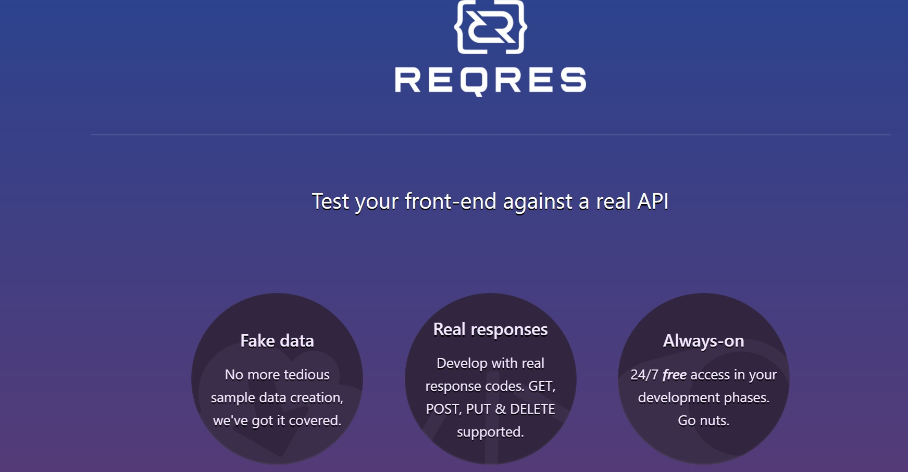

# rest-api_reqresIn
> <a target="_blank" href="https://miro.com/">Link to reqresIn api web page</a>

## :page_with_curl: Table of contents:
- [Technology stack](#computer-technology-stack)
- [Test cases](#bookmark_tabs-test-cases)

## :computer: Technology stack

## :bookmark_tabs: Test cases
- :heavy_check_mark: Getting a user list test
- :heavy_check_mark: Creation a new user test
- :heavy_check_mark: Updating user data test
- :heavy_check_mark: Registration a known user test
- :heavy_check_mark: Registration an unknown user test
