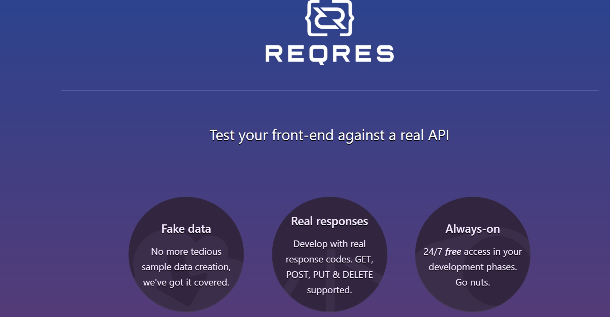
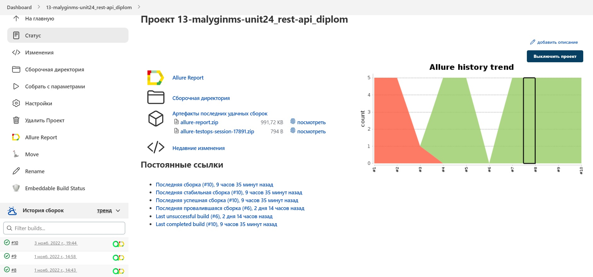
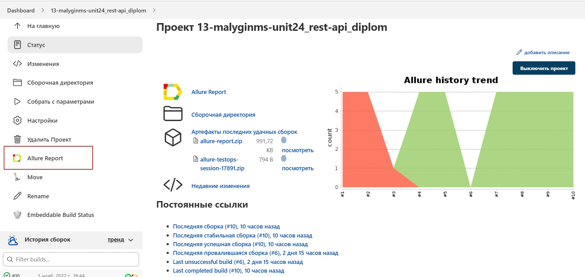
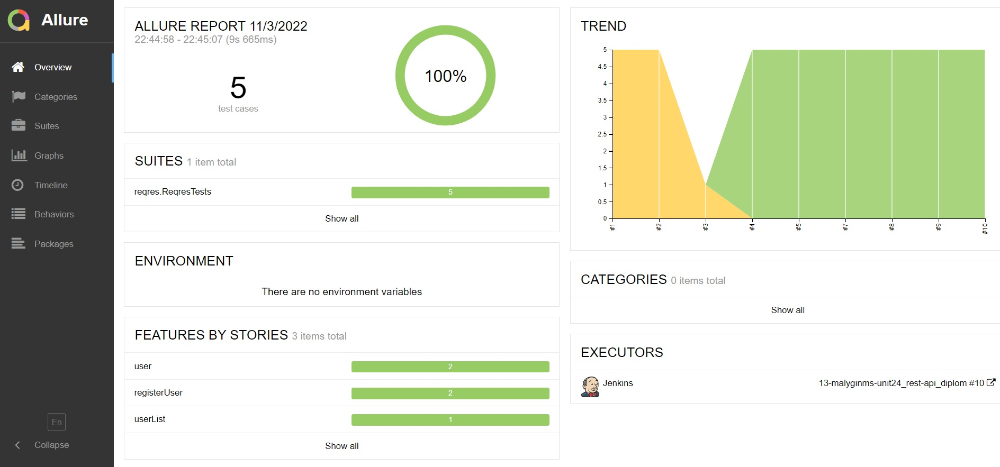
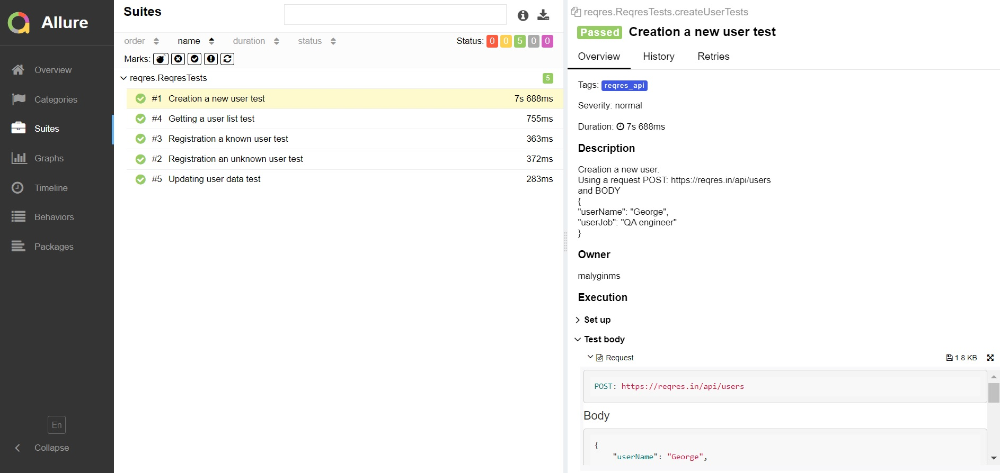
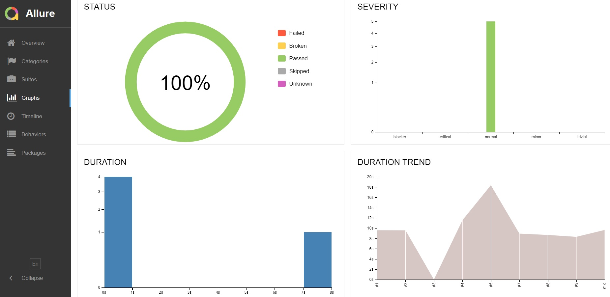
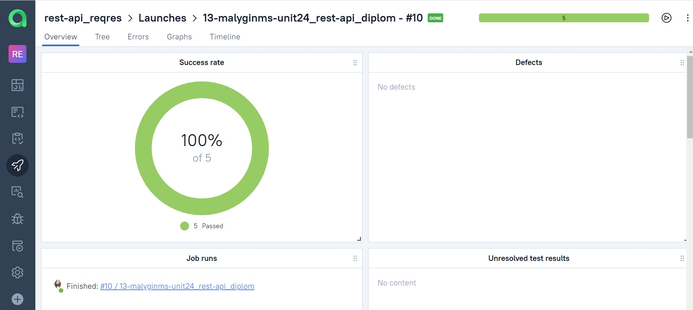
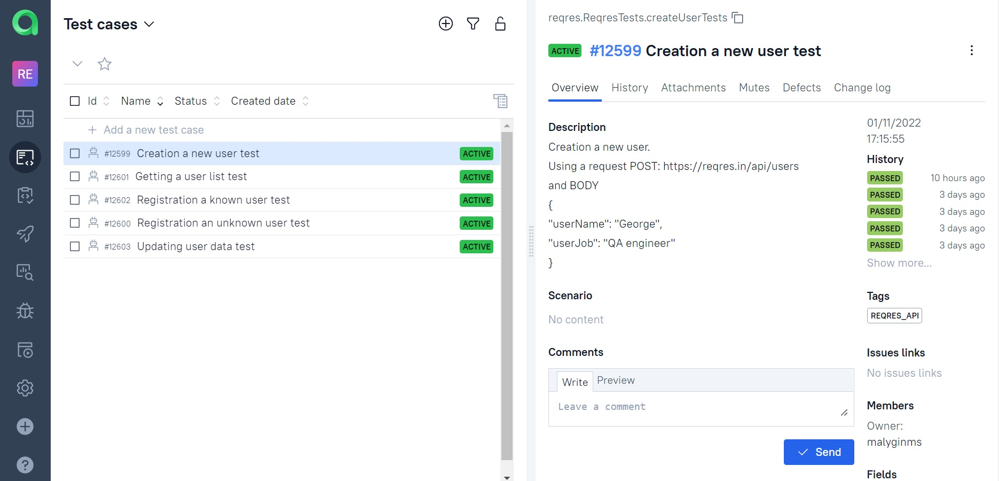
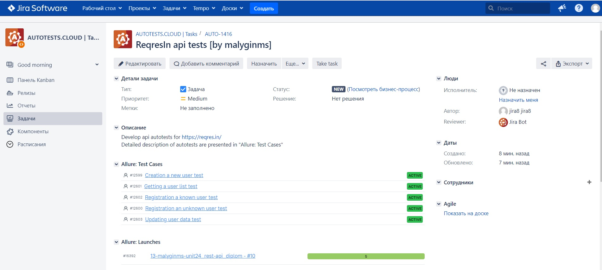
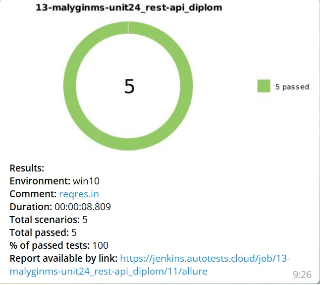

# rest-api_reqresIn
> <a target="_blank" href="https://miro.com/">Link to reqresIn api web page</a>



## :page_with_curl: Table of contents:
- [Technology stack](#computer-technology-stack)
- [Test cases](#bookmark_tabs-test-cases)
- [Deployment in Jenkins](#-deployment-in-Jenkins)
- [Running tests using terminal](#desktop_computer-running-tests-using-terminal)
- [Allure reports](#-allure-reports)
- [Allure TestOps integration](#-allure-TestOps-integration)
- [Jira integration](#-jira-integration)
- [Notification in telegram](#-notification-in-telegram)

## :computer: Technology stack
<p align="center">
<a href="https://www.java.com/"></a>
<a href="https://github.com/"></a>
<a href="https://www.jetbrains.com/idea/"></a>
<a href="https://gradle.org/"></a>
<a href="https://selenide.org/"></a>
<a href="https://rest-assured.io/"></a>
<a href="https://junit.org/junit5/"></a>
<a href="https://aerokube.com/selenoid/"></a>
<a href="https://www.jenkins.io/"></a>
<a href="https://github.com/allure-framework/allure2"></a>
<a href="https://qameta.io/"></a>
<a href="https://www.atlassian.com/software/jira"></a>
<a href="https://telegram.org/"></a>
</p>

## :bookmark_tabs: Test cases
- :heavy_check_mark: Getting a user list test
- :heavy_check_mark: Creation a new user test
- :heavy_check_mark: Updating user data test
- :heavy_check_mark: Registration a known user test
- :heavy_check_mark: Registration an unknown user test

##  Deployment in Jenkins
> <a target="_blank" href="https://jenkins.autotests.cloud/job/13-malyginms-unit24_rest-api_diplom/">Build in Jenkins</a>



## :desktop_computer: Running tests using terminal

#### Command for local run:
```bash
gradle clean test
```

#### Command for remote run:
```bash
clean reqres_tests
-DselenoidStand=${SELENOID_STAND}
```

##  Allure reports
> <a target="_blank" href="https://jenkins.autotests.cloud/job/13-malyginms-unit24_rest-api_diplom/allure/">Link to Allure reports</a>



#### Overview dashboard

<p align="center">

</p>

#### Suites dashboard
You can find detailed description of tests and attachments(screenshots, request, response) which will be useful for debugging, test documentations, etc

<p align="center">

</p>

#### Graphs dashboard

<p align="center">

</p>

##  Allure TestOps integration
> <a target="_blank" href="https://allure.autotests.cloud/launch/16392">Link to Allure TestOps</a>


#### Launches dashboard

<p align="center">

</p>

#### Test cases dashboard

<p align="center">

</p>

##  Jira integration
> <a target="_blank" href="https://jira.autotests.cloud/browse/AUTO-1416">Link to Jira task</a>



##  Notification in telegram

